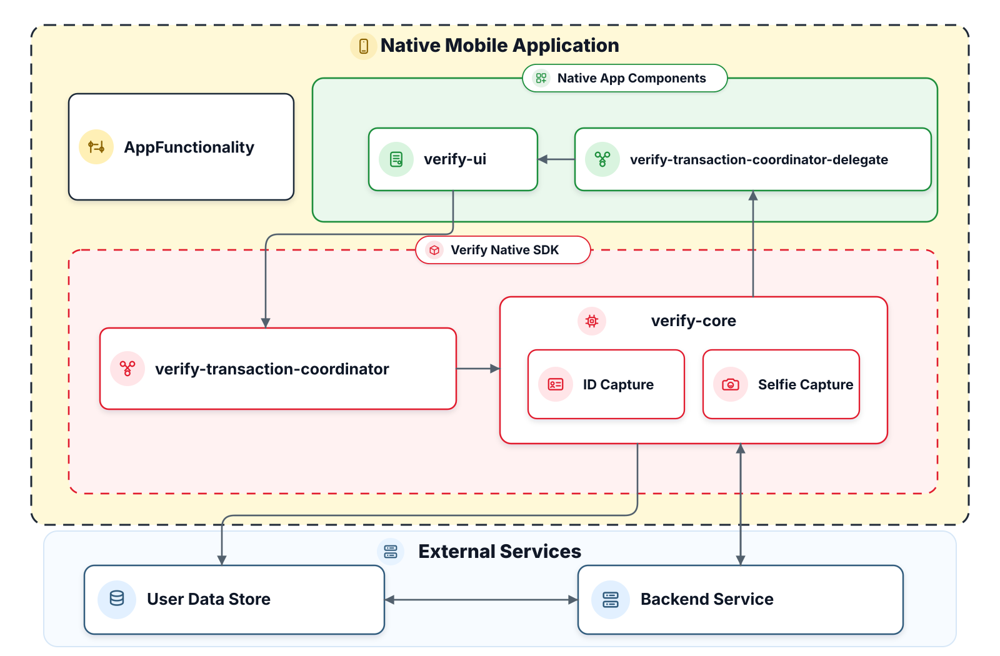
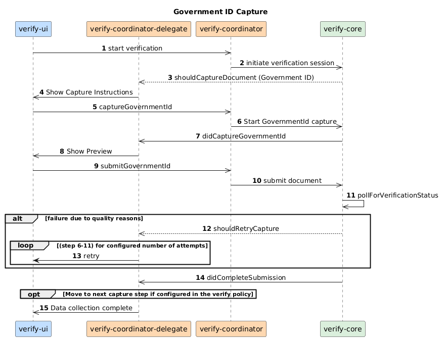
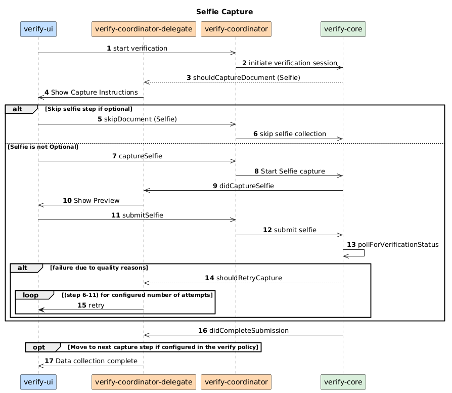
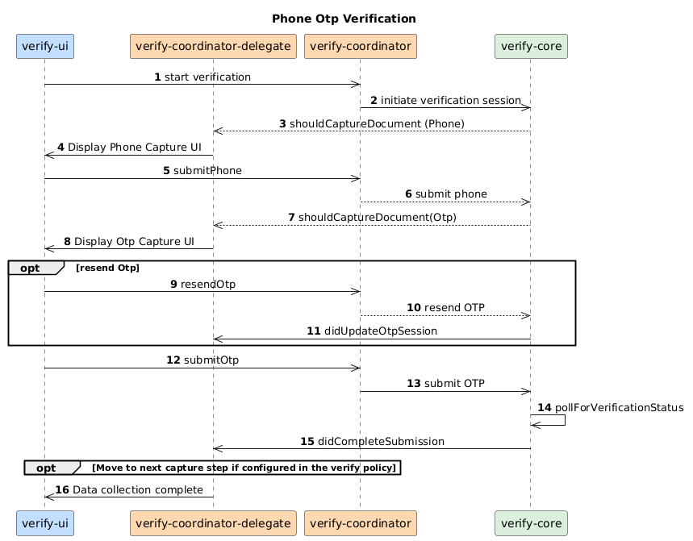
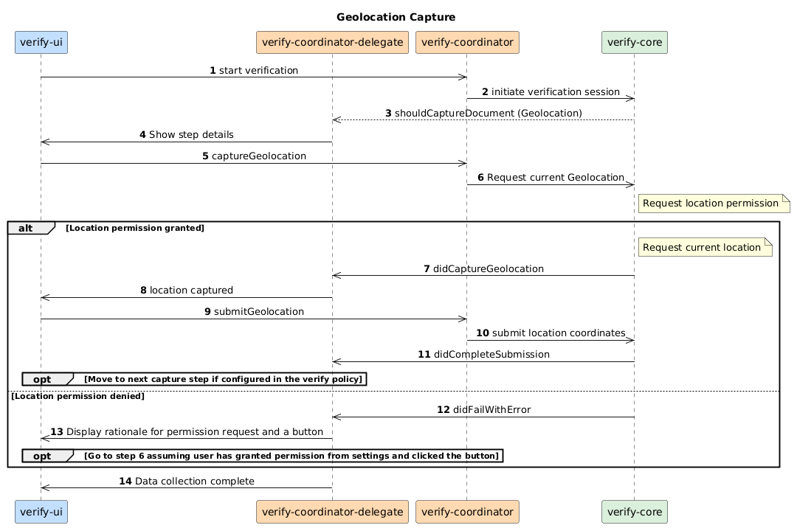

# PingOne Verify Android SDK

PingOne Verify is an identity verification service that supports the collection and authentication of identity evidence, including government-issued IDs, selfies, email/phone OTPs, and geolocation. This SDK functions as the collection client for the verification flow, capturing user evidence and performing quality checks to ensure documents and images meet the required standards before they are submitted for verification.

---

## Contents

1. [Components](#components)
2. [Prerequisites](#prerequisites)
3. [Installation](#installation)
4. [Class Reference](#class-reference)

---

## Components



| Component | Description |
|-----------|-------------|
| **Native Mobile Application** | The consuming application that integrates the SDK. It initiates verification flows by invoking public client methods and is responsible for integrating and customizing the open-source UI module. |
| **verify-ui** | Open-source UI module that provides the instructional and interactive screens necessary for the various verification capture flows. The source lives in `:app` and is compiled directly into the app target. |
| **verify-core** | The central coordination layer. It orchestrates all necessary flows between the UI and capture components, manages secure data transmission to the backend service, and ensures successful execution of the overall transaction logic. |
| **ID Capture Module** | Integrates with BlinkID to capture images and extract data from government identity documents. |
| **Selfie Capture Module** | Manages the facial image capture process, performs real-time quality checks on live frames, and executes liveness detection to mitigate injection attacks. |
| **verify-transaction-coordinator** | Interface implemented within the core module; utilized by the UI to execute specific actions (e.g., submit data). |
| **verify-transaction-coordinator-delegate** | Interface implemented by the UI; utilized by the core module to notify the UI to perform actions based on instructions received from the backend service. |
| **Backend Service** | PingOne Verify services hosted in the PingOne multi-tenant SaaS platform. Provides data collection and transaction state management, enabling a "backend-driven UI" flow alongside verify-core. |

---

## Integration Flow Diagrams

The diagrams below show the message flow between your UI layer (`verify-ui`), the delegate you implement (`verify-coordinator-delegate`), the coordinator API (`verify-coordinator`), and the SDK core (`verify-core`) for each capture type.

### Government ID Capture

Scans a government-issued document (passport, driver licence, or national ID) and submits it for server-side verification. On quality failures, the SDK requests a retry up to the number of attempts configured in your verify policy.



---

### Selfie Capture

Captures a live selfie for liveness detection and face-match verification. If the selfie step is marked optional in your verify policy, the UI can skip it entirely. On quality failures, the SDK requests a retry.



---

### Email OTP Verification

Collects the user's email address, sends a one-time passcode to that address, and validates it. The user can request a resend at any time; the SDK refreshes the OTP session and restarts the countdown timers automatically.


---

### Phone OTP Verification

Same flow as email OTP but the one-time passcode is delivered via SMS. The user enters their phone number, receives a code, and submits it.



---

### Geolocation Capture

Requests the device's current location. If the user grants permission the coordinates are captured and submitted immediately. If permission is denied the SDK surfaces an error; the UI should display a rationale and a button so the user can grant permission from Settings and retry.



---

## Prerequisites

- Android Studio with Gradle
- Android SDK 26 or later
- Physical device recommended (camera is required; emulator is not supported for capture steps)

---

## Installation

### Built-in UI (use open-source verify-ui source)

1. Add to your app's `build.gradle`:

```groovy
dependencies {
    implementation project(path: ':verify-core')
    implementation project(path: ':language-provider')

    runtimeOnly project(path: ':selfie-capture')    // required for selfie capture
    runtimeOnly project(path: ':id-capture')         // required for government ID capture
    runtimeOnly project(path: ':location-provider')  // required for geolocation
}
```

2. Copy vendor AARs into their module `libs/` directories:

| AAR | Module |
|-----|--------|
| `iad.aar` | `selfie-capture/libs/` |
| `blinkid-core.aar` | `id-capture/libs/` |

Provider modules (`:selfie-capture`, `:id-capture`, `:location-provider`) depend on `:neo-interfaces`.

> **Language pack:** Override string values in your app's `res/values/strings.xml` using same keys.

3. The verify-ui source code in `:app/src/main/java/.../ui/` is compiled directly into your app target — no separate module import needed.

---

## Quick Start — Built-in UI

`PingOneVerifyHelper` owns the full lifecycle — async init, language pack, app theme, and navigation. Construct it and the verification flow starts automatically when ready.

```java
public class MyActivity extends AppCompatActivity {

    void start(String url) {
        new PingOneVerifyHelper(this, url);
    }

}
```

`PingOneVerifyHelper` handles navigation, fragment routing, app theme, language pack, and all delegate callbacks internally. No additional wiring is needed.

---

### Localization

Override any string by replacing its value in your app's `res/values/strings.xml`.

---

## Migration Guide

You can refer to the [migration guide](MIGRATION.md).

---

## Class Reference

You can refer to the [class reference](Class Reference.md).

---
